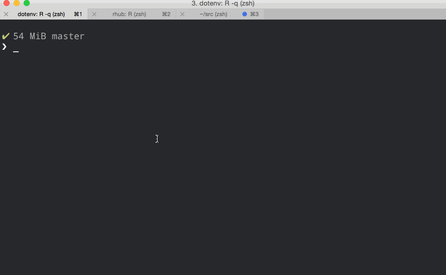

# rhub 

> Connect to R-hub, from R

[](https://travis-ci.org/r-hub/rhub)
[](https://ci.appveyor.com/project/gaborcsardi/rhub)
[](http://www.r-pkg.org/pkg/rhub)
[](http://www.r-pkg.org/pkg/rhub)
[](https://codecov.io/github/r-hub/rhub?branch=master)

Run `R CMD check` on any of the R-hub architectures, from the
command line.

## Introduction

R-hub is a multi-platform build and check service for R packages.
This packages uses the R-hub API to connect to R-hub and start package
checks on various architectures.

## Installation

Install the package from CRAN:

```r
install.packages("rhub")
```

## Usage

```r
library(rhub)
```

### Validating your email address

To build packages, first you need to validate your email address with
`validate_email()`. The package tries to detect your email address using [`whoami`](https://github.com/r-lib/whoami#whoami) and the maintainer email listed in DESCRIPTION;
and if it fails to do this correctly, you'll need to specify it.


`rhub` stores the token permanently on the machine, so you do not need
to validate your email again. You can also copy your token to other
machines, see `list_validated_emails()`.

Currently you cannot use the token obtained via this function, in the Web
UI of R-hub.

### Listing R-hub platforms

```r
platforms()

```

```r
#> debian-gcc-devel:
#>   Debian Linux, R-devel, GCC
#> debian-gcc-patched:
#>   Debian Linux, R-patched, GCC
#> debian-gcc-release:
#>   Debian Linux, R-release, GCC
#> fedora-clang-devel:
#>   Fedora Linux, R-devel, clang, gfortran
#> fedora-gcc-devel:
#>   Fedora Linux, R-devel, GCC
#> linux-x86_64-centos6-epel:
#>   CentOS 6, stock R from EPEL
#> linux-x86_64-centos6-epel-rdt:
#>   CentOS 6 with Redhat Developer Toolset, R from EPEL
#> linux-x86_64-rocker-gcc-san:
#>   Debian Linux, R-devel, GCC ASAN/UBSAN
#> ubuntu-gcc-devel:
#>   Ubuntu Linux 16.04 LTS, R-devel, GCC
#> ubuntu-gcc-release:
#>   Ubuntu Linux 16.04 LTS, R-release, GCC
#> windows-x86_64-devel:
#>   Windows Server 2008 R2 SP1, R-devel, 32/64 bit
#> windows-x86_64-oldrel:
#>   Windows Server 2008 R2 SP1, R-oldrel, 32/64 bit
#> windows-x86_64-patched:
#>   Windows Server 2008 R2 SP1, R-patched, 32/64 bit
#> windows-x86_64-release:
#>   Windows Server 2008 R2 SP1, R-release, 32/64 bit
```

You can use the platform ids (e.g. `debian-gcc-devel`) to select between
platforms.

### Run a package check

`check()` runs an `R CMD check` on the package in the specified directory,
or specified source R package tarball created by `R CMD build` or
`devtools::build()`. It defaults to the working directory.

```r
check()
```

In interactive R sessions, the output of the check is printed to
the screen.



### Shortcuts for quick checks

These are quick shortcuts that select the right platform:

* `check_on_linux()` and `check_on_windows()` select the operating system.
* `check_on_debian()`, `check_on_ubuntu()`, `check_on_fedora()` and
  `check_on_centos()` select an appropriate Linux platform.
* `check_with_roldrel()`, `check_with_rrelease()`, `check_with_rpatched()`
  and `check_with_rdevel()` select an R version.
* `check_with_valgrind()` runs the build and check on Linux, in `valgrind`
  to find memory leaks and pointer errors.
* `check_with_sanitizers()` runs all package package tests, examples and
  vignettes with Address Sanitizer and Undefined Behavior Sanitizer, see
  below.

### Shortcut for preparing a CRAN submission

`rhub::check_for_cran`: Check an R-package on R-hub, for a CRAN submission.

### Sanitizers for compiled code

R-hub provides a special Docker image to run Address Sanitizer (ASAN) and
Undefined Behavior Sanitizer (UBSAN). This is based on the `r-devel-san`
image of the [Rocker project](https://github.com/rocker-org/r-devel-san).

This image does not run `R CMD check` at all, but it runs

1. package tests,
2. all manual examples, and
3. all vignette code

with ASAN and UBSAN enabled.


### Note about `rhub` naming conventions

Most `rhub` functions' names start with a verb (`check()`, `list_my_checks()`). 

Do not confuse `rhub::check()` and `rhub::rhub_check` (not a function)! No function name start with `rhub_`, but there are three exported classes whose name start with `rhub_`: `rhub::rhub_check`, `rhub::rhub_check_for_cran` and `rhub::rhub_check_list`. 

## License

MIT © R Consortium
